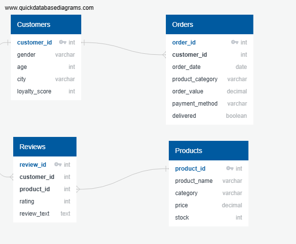

# 🛒 E-Commerce SQL Analysis

## Tools & Technologies
- SQL Server
- SQL Queries for data analysis
- Markdown for documentation
## Files
- [exploration.sql](exploration.sql) – All queries used in database exploration
- [Analysis.sql](Analysis.sql) – All queries used for analysis with insights
## Business Problem:
The e-commerce company is experiencing **slower sales growth** and **mixed customer satisfaction**.
Management wants to understand:
1. Which **product categories** bring the most revenue.
2. Who their **best customers** are and how loyalty impacts spending.
3. Whether **delivery performance** affects customer satisfaction.
4. How **customer reviews** and **ratings** influence product sales.
5. Which **payment methods** and **cities** are most profitable.

By answering these questions with SQL, the company can:
- Focus marketing on high-value customers.
- Improve stock management for popular products.
- Increase delivery success rate.
- Use customer feedback to improve product quality.

## Dataset Description:
The database has 4 tables:

| **Orders**        | **Customers**   | **Products**    | **Reviews**       |
|------------------|----------------|----------------|-----------------|
| order_id         | customer_id    | product_id     | review_id       |
| customer_id      | gender         | product_name   | customer_id     |
| order_date       | age            | category       | product_id      |
| product_category | city           | price          | rating          |
| order_value      | loyalty_score  | stock          | review_text     |
| payment_method   |                |                |                 |
| delivered        |                |                |                 |

## Entity Relationship Diagram (ERD)

## Database Exploration
During this phase, I explored the database structure and content to understand the data before analysis.
I used SQL queries to check tables, counts, averages, and missing values.
You can view all queries in the [exploration.sql](exploration.sql) 
 file.

## Analysis
This section contains SQL analyses that answer the business questions and produce actionable insights.
All queries and inline observations are in the [Analysis.sql](Analysis.sql)
 file — run them in SSMS and review the exported results.

 ## Insights & Recommendations

Based on the SQL analysis of the e-commerce dataset, here are the main insights and strategic recommendations:

| **Area**                  | **Insights**                                                                 | **Recommendations**                                                                 |
|----------------------------|------------------------------------------------------------------------------|-------------------------------------------------------------------------------------|
| **Revenue by Category**    | Electronics leads in revenue (~10.8K). Clothing has strong sales but lowest ratings (2.90). Home balances high revenue and best ratings (3.05). | Improve Clothing quality/service. Enhance Electronics experience. Promote Home products as “high-value & loved.” |
| **Customer Loyalty (LTV)** | High-loyalty customers (80–100) spend most (~177). Lower buckets (20–39 & 0–19) still show moderate spend (~160). | Create tiered loyalty rewards. Re-engage low-loyalty customers with personalized offers. |
| **Delivery & Satisfaction**| All deliveries → slightly higher ratings (2.98 vs 2.95). Delivery matters but isn’t the biggest driver. | Maintain delivery reliability. Focus more on improving product quality and service. |
| **Ratings vs Revenue**     | High-revenue categories (Electronics, Clothing) don’t have top ratings. Home products balance both. | Use reviews to improve weak categories. Market Home products more aggressively. |
| **Payment Methods**        | UPI generates most revenue (~10K). Cash = most transactions (222). Credit Card users spend the most per order (~52). | Promote UPI & Credit Cards via discounts/rewards. Streamline cash handling for efficiency. |
| **Revenue by City**        | Mumbai = top revenue (~11K, 233 orders). Delhi = highest avg. order value (~52.8). Hyderabad shows growth potential. | Target campaigns in Mumbai (volume) & Delhi (value). Invest in Hyderabad growth. |

### 🎯 Overall Strategy
- **Product:** Fix Clothing dissatisfaction, strengthen Electronics, promote Home as a balanced winner.
- **Customer:** Maximize high-loyalty spend, re-activate low-loyalty customers.
- **Operations:** Maintain delivery consistency, encourage digital payments.
- **Market:** Double down on Mumbai & Delhi, expand Hyderabad growth.

 
